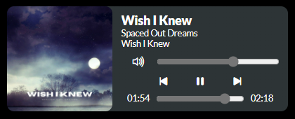

# Spotify Quick Menu

An always-on-top mini player for Spotify, 
built with WPF and a WebView for a sleek and modern experience.
Control your music effortlessly while multitasking!

Easy to edit with `HTML`, `CSS` and `JS`


---

# Features
- Always-on-top window for quick music control
- Clean, responsive and customizable design using HTML, CSS, and JavaScript

---

# Built With
- **Frontend:** WPF with WebView (`HTML`, `CSS` & `JS`)
- **Backend:** HTTPClient for API communication (The `Source` class library can be reused in any project that needs a Spotify API connection)
- **APIs:** Spotify Web API

---

# Installation
Follow these simple steps to set up and run the quick menu:

1. **Clone the repository:**
``` Bash
git clone https://github.com/VincentBrodin/SpotifyQuickMenu.git
cd SpotifyQuickMenu
```

2. **Set up your Spotify API credentials:**
- Create a file named `secrets.txt` in the root directory.
- Add your Spotify API credentials to the file in this format:
``` txt
SPOTIFY_CLIENT_ID=your_client_id  
SPOTIFY_CLIENT_SECRET=your_client_secret  
SPOTIFY_REDIRECT_URI=your_redirect_uri  
```
3. **Build and run the project:**
Open the solution in Visual Studio, restore NuGet packages, and run the project.

---

# How to use
1. Launch the app.
2. Log in to you Spotify account when prompted.
3. Enjoy controlling your music via the quick menu!

---

# Known issues/ problems
### Spotify API token expiration
- Spotify's tokens are valid for only 3600 seconds (1 hour). The app logs these tokens locally in a `token.json` file.
- When the token expires, the mini player will automatically fetch a new token when you attempt an action (like play/pause). This process is seamless and does not require manual intervention.
- **If the token refresh fails:**
	- Delete the `token.json` file in the root directory.
	- Relaunch the app to generate a new token.
---

# Screenshots/GIFs



---

# Contributing
Contributions are welcome! If you'd like to report a bug or suggest an improvement, feel free to open an issue or submit a pull request.
